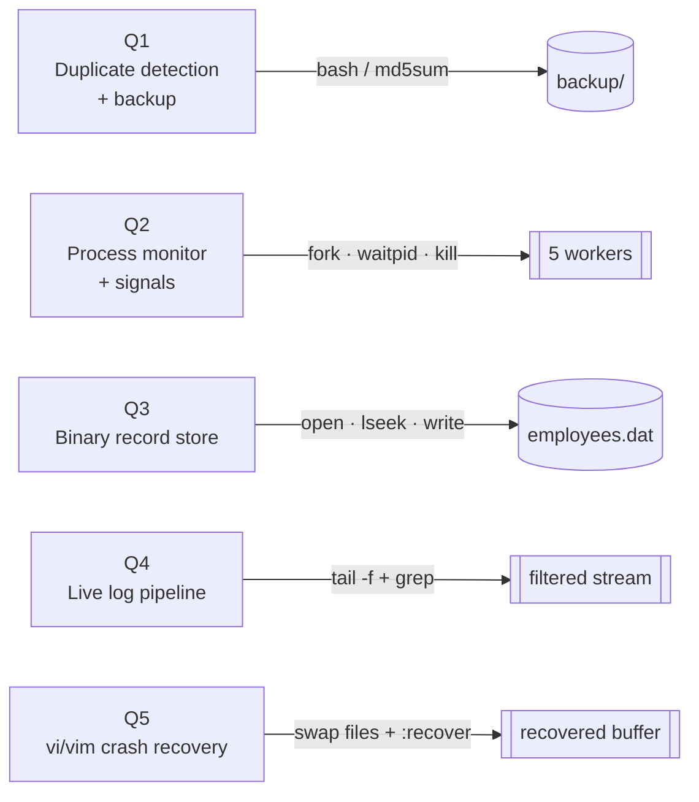

<div align="center">

# Linux Systems Programming Lab

**Five kernel-facing problems, one repo: process control, raw syscalls, shell automation, log pipelines, and editor crash recovery.**


</div>

---

## What's in here

Five independent modules, each a self-contained problem with its own source, docs, and captured run evidence — no shared state between them.



## Module breakdown

| | Module | Problem | Toolchain | Marks |
|---|---|---|---|:-:|
| 🗂️ | [`Question1/`](Question1) | Detect duplicate submissions via MD5, back up uniques, report the rest | Bash · `md5sum` · `mktemp` | 4 |
| 🧬 | [`Question2/`](Question2) | Fork worker processes, reap them via `SIGCHLD`, escalate `SIGTERM → SIGKILL` on timeout | C11 · `fork` · `waitpid` · `sigaction` | 4 |
| 💾 | [`Question3/`](Question3) | Read/write fixed-width binary records with raw syscalls — no `stdio` | C11 · `open` · `lseek` · `read`/`write` | 4 |
| 📡 | [`Question4/`](Question4) | Filter a growing log file for `ERROR` lines in real time | `tail -f` · `grep --line-buffered` | 4 |
| 🩹 | [`Question5/`](Question5) | Simulate a crash mid-edit, recover from vim's swap file | `vim -r` · `:recover` · `:reg` | 4 |
| | | | **Total** | **20** |

Each module folder ships the same four artifacts: source/script, `explanation.md` (design rationale), `outputs.md` (captured run), and `screenshots/` (visual proof).

## Running each module

<details>
<summary><strong>Q1 — Duplicate detection & backup</strong></summary>

```bash
cd Question1
chmod +x duplicate_backup.sh
./duplicate_backup.sh
cat reports/backup_report_*.txt
```
Hashes every file in `sample_submissions/`, backs up first-seen copies to `backup/`, and writes a timestamped report to `reports/`.
</details>

<details>
<summary><strong>Q2 — Process monitor & signal escalation</strong></summary>

```bash
cd Question2
make && ./process_monitor
```
Forks 5 workers, reaps normal exits asynchronously via a `SIGCHLD` handler, and — for any child still alive past an 8s budget — escalates `SIGTERM` then `SIGKILL`.
</details>

<details>
<summary><strong>Q3 — Binary record I/O</strong></summary>

```bash
cd Question3
gcc -Wall -Wextra -std=c11 -D_POSIX_C_SOURCE=200809L employee_records.c -o employee_records
./employee_records
hexdump -C employees.dat
```
Writes 5 fixed-size (96-byte) employee records, then demonstrates random-access reads and in-place updates purely via `lseek`/`read`/`write`.
</details>

<details>
<summary><strong>Q4 — Real-time log pipeline</strong></summary>

```bash
cd Question4
# terminal 1
tail -f sample.log | grep --line-buffered "ERROR"
# terminal 2
echo "[$(date '+%Y-%m-%d %H:%M:%S')] ERROR: Database timeout" >> sample.log
```
`--line-buffered` keeps `grep` from waiting on a full buffer, so injected `ERROR` lines surface with no visible delay.
</details>

<details>
<summary><strong>Q5 — vi/vim crash recovery</strong></summary>

```bash
cd Question5
cat vi_recovery.md
```
Walks through swap-file creation, the `E325: ATTENTION` prompt after a simulated crash, `:recover` / `vim -r`, and layered recovery via registers + persistent undo.
</details>

## Layout

```text
.
├── Question1/   duplicate_backup.sh, sample_submissions/, backup/, reports/
├── Question2/   process_monitor.c, Makefile
├── Question3/   employee_records.c, employees.dat
├── Question4/   sample.log, error_report.log
└── Question5/   vi_recovery.md
```

Every module also carries `README.md`, `explanation.md`, `execution_commands.md`, `outputs.md`, and `screenshots/` — see the module link in the table above.

## Environment

| | |
|---|---|
| OS | Linux / macOS, POSIX-compliant |
| Compiler | GCC 9+ or Clang, `-std=c11 -D_POSIX_C_SOURCE=200809L` |
| Shell | Bash 4.0+ |
| CLI tools | `md5sum`/`md5`, `grep`, `tail`, `make`, `vim`, `hexdump` |

---

<div align="center">

*Operating Systems & Linux Systems Programming — graded lab assignment.*

</div>
